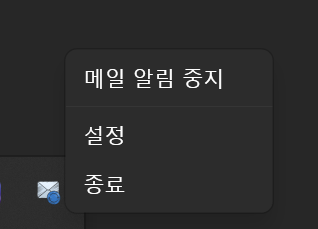
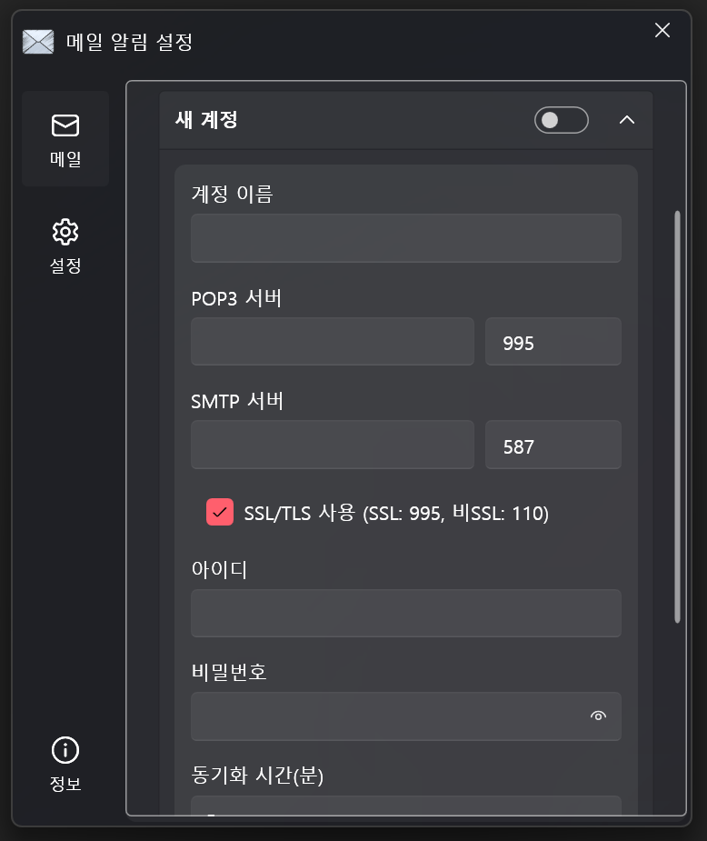
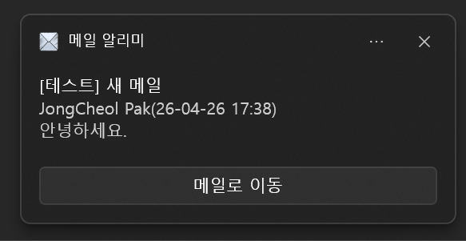
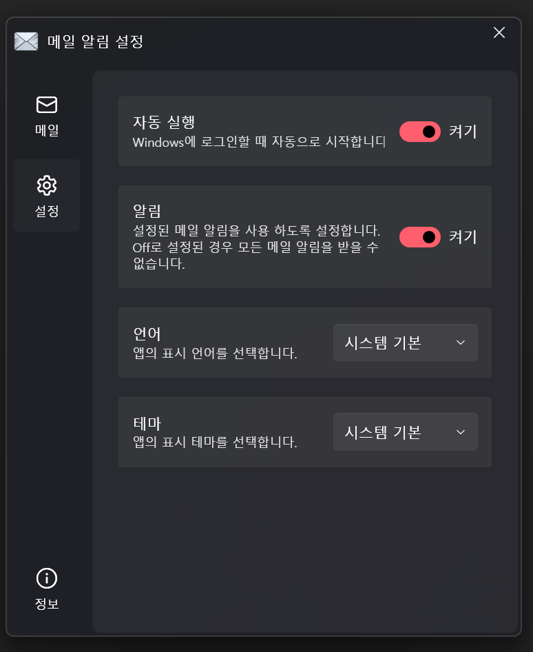

<p align="center">
  
</p>

<h1 align="center">MailTrayNotifier</h1>

<p align="center">
POP3 메일 서버를 주기적으로 확인하고 새 메일이 도착하면 Windows 토스트 알림으로 알려주는 트레이 상주 앱입니다.<br/>
WPF · .NET 10 · MVVM(CommunityToolkit.Mvvm) · WPF-UI 기반으로 만들어졌습니다.
</p>

## 주요 기능

- POP3 서버 연결 및 UID 기반 새 메일 감지
- 다중 메일 계정 지원 (최대 10개, 계정별 독립 폴링 주기)
- 새 메일 도착 시 Windows 토스트 알림 표시 (클릭 시 처리)
- 시스템 트레이 상주 (좌클릭: 설정 창, 우클릭: 메뉴)
- 트레이 메뉴에서 메일 알림 시작/중지 토글
- 다국어 UI: English / 한국어 / 日本語 / 简体中文 / 繁體中文 (시스템 기본 자동 선택 가능)
- 테마 변경: 시스템 기본 / 다크 / 라이트 (즉시 적용)
- GitHub Releases 기반 자동 업데이트 확인 및 알림
- 계정 설정 내보내기 / 가져오기
- 비밀번호는 Windows DPAPI로 암호화 저장

## 시스템 요구 사항

- Windows 10 (1809 이상) 또는 Windows 11
- .NET 10 Desktop Runtime (자체 포함 빌드를 사용하는 경우 별도 설치 불필요)

## 설치

### 릴리스에서 설치

1. [Releases](https://github.com/jongcheol-pak/MailTrayNotifier/releases) 페이지에서 최신 버전을 내려받습니다.
2. 압축을 해제한 뒤 `MailTrayNotifier.exe`를 실행합니다.

### 소스에서 빌드

```powershell
git clone https://github.com/jongcheol-pak/MailTrayNotifier.git
cd MailTrayNotifier
dotnet build -c Release
```

빌드 결과물은 `bin/Release/net10.0-windows10.0.26100.0/` 아래에 생성됩니다.

## 사용 방법

1. **앱 실행** — 첫 실행 시 시스템 트레이에 메일 아이콘이 나타납니다 (창은 열리지 않음).
2. **설정 창 열기** — 트레이 아이콘을 좌클릭하거나, 우클릭 메뉴에서 `설정`을 선택합니다.

   

3. **계정 추가** — 좌측 메뉴 `메일` → `계정 추가` 버튼을 누르고 정보를 입력합니다.
   - **계정 이름**: 목록에서 표시할 별칭 (선택)
   - **POP3 서버 / 포트**: 메일 제공자가 안내한 수신 서버 주소와 포트 (예: `pop.gmail.com` / `995`)
   - **SMTP 서버 / 포트**: 발신 서버 정보 (현재 수신에는 사용하지 않으며 향후 확장을 위한 항목)
   - **SSL/TLS 사용**: 일반적으로 활성화 권장 (SSL: 995, 비SSL: 110)
   - **아이디 / 비밀번호**: 메일 계정 자격 증명 (Gmail 등은 앱 비밀번호 사용)
   - **동기화 시간(분)**: 1~60분 사이의 폴링 주기 (기본 5분)

   

4. **저장 및 활성화** — 우측 상단 `저장` 버튼을 누른 뒤, 계정 헤더의 토글 스위치로 활성화합니다.
5. **알림 수신** — 새 메일이 도착하면 Windows 토스트 알림이 표시되고, `메일로 이동` 버튼이나 알림 본문을 클릭하면 해당 메일이 처리된 것으로 기록됩니다.

   

6. **알림 중지** — 트레이 우클릭 → `메일 알림 중지`로 전체 폴링을 일시 중지할 수 있습니다.

### 일반 설정

좌측 메뉴 `설정`에서 자동 실행, 알림 사용 여부, 언어, 테마를 변경할 수 있으며 변경 즉시 적용됩니다.



- **자동 실행**: Windows 로그인 시 자동으로 시작
- **알림**: 메일 알림 토스트 사용 여부
- **언어**: 시스템 기본 / English / 한국어 / 日本語 / 简体中文 / 繁體中文
- **테마**: 시스템 기본 / 다크 / 라이트
- **계정 내보내기 / 가져오기**: 다른 PC로 설정을 옮기거나 백업할 때 사용합니다 (비밀번호는 DPAPI 특성상 동일 사용자 계정에서만 복호화됩니다).
- **초기화**: 모든 설정과 메일 상태를 삭제합니다.

## 설정 파일 위치

| 항목 | 경로 |
|---|---|
| 설정 파일 | `%LocalAppData%\MailTrayNotifier\settings.json` |
| 메일 UID 상태 | `%LocalAppData%\MailTrayNotifier\mail_state.json` |

## 주요 의존성

- [CommunityToolkit.Mvvm](https://github.com/CommunityToolkit/dotnet) — MVVM 프레임워크
- [WPF-UI](https://github.com/lepoco/wpfui) — Fluent 디자인 컨트롤
- [Hardcodet.NotifyIcon.Wpf](https://github.com/hardcodet/wpf-notifyicon) — 트레이 아이콘
- [MailKit](https://github.com/jstedfast/MailKit) — POP3 클라이언트
- [Microsoft.Toolkit.Uwp.Notifications](https://learn.microsoft.com/windows/apps/design/shell/tiles-and-notifications/) — Windows 토스트 알림

## 알려진 제한 사항

- POP3만 지원합니다 (IMAP 미지원).
- 비밀번호는 Windows DPAPI로 암호화되어 동일 사용자 프로필에서만 복호화됩니다.
- 동시 등록 가능한 계정은 최대 10개입니다.

## 라이선스

[MIT License](LICENSE) 하에 배포됩니다.

Copyright © 2026 JongCheol Pak ([@jongcheol-pak](https://github.com/jongcheol-pak))

## 링크

- 공식 소개 페이지: <https://jongcheol-pak.github.io/projects/mailtraynotifier/>
- 이슈 및 제안: [GitHub Issues](https://github.com/jongcheol-pak/MailTrayNotifier/issues)
